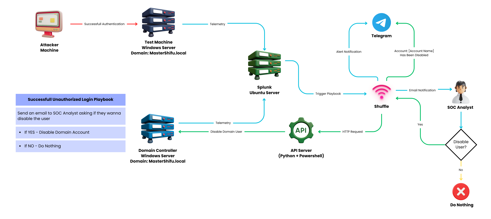
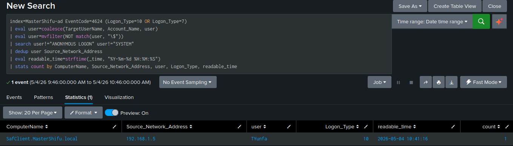
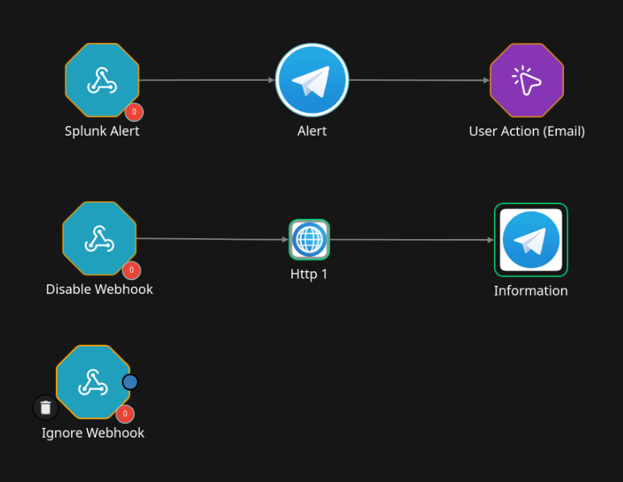
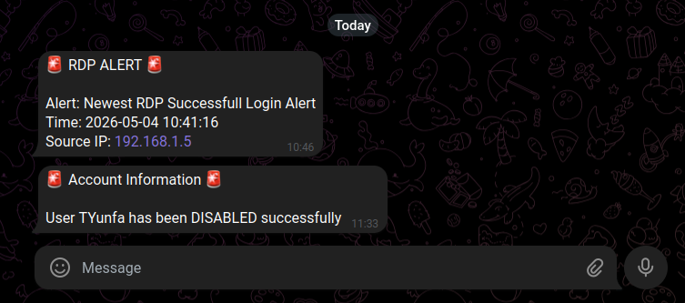
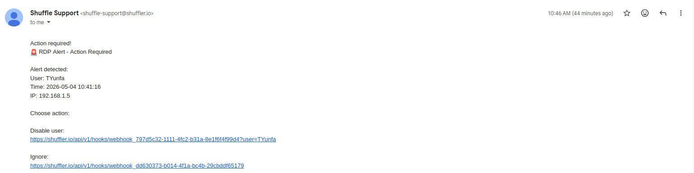
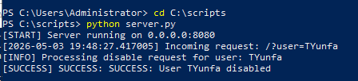
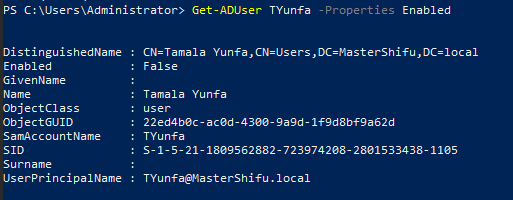

# 🔐 Automated RDP Incident Response System (SIEM + SOAR + Active Directory)

## 📌 Overview

This project demonstrates an automated Security Operations Center (SOC) workflow designed to detect and respond to suspicious Remote Desktop Protocol (RDP) login activities.

The system integrates:
- **Splunk (SIEM)** for detection
- **Shuffle (SOAR)** for automation
- **Active Directory (AD)** for user management
- **Python + PowerShell API** for executing response actions

When a suspicious RDP login is detected, the system automatically:
1. Generates an alert in Splunk
2. Sends notifications via Telegram and Email
3. Allows a SOC analyst to approve or ignore the action
4. If approved, automatically disables the user account in Active Directory

This simulates a real-world SOC environment with **human-in-the-loop incident response**.

---

## 🎯 Objectives

- Detect RDP login activity using Splunk SIEM
- Automate alerting via Telegram and Email
- Implement SOAR workflow using Shuffle
- Enable analyst decision-making (approve/deny response)
- Automatically disable compromised Active Directory accounts
- Build an end-to-end SOC incident response pipeline

---

## 🏗️ Architecture



---

## 🔄 Workflow

1. A user logs in via RDP (Event ID 4624, Logon Type 10)
2. Splunk detects the login event
3. Splunk triggers an alert via webhook to Shuffle
4. Shuffle performs:
   - Telegram alert notification
   - Email with action decision (Disable / Ignore)
5. SOC Analyst reviews the alert:
   - If **Ignore** → workflow ends
   - If **Disable** → continue
6. Shuffle sends request to API server
7. API server executes PowerShell script
8. Active Directory disables the user account
9. Telegram sends confirmation message

---

## 🧰 Technologies Used

- **Splunk** – Security Information and Event Management (SIEM)
- **Shuffle** – Security Orchestration Automation and Response (SOAR)
- **Active Directory (Windows Server)** – Identity management
- **PowerShell** – User account automation
- **Python** – API server for executing response
- **Ngrok** – Secure external access to local API
- **Telegram Bot API** – Alert notifications
- **SMTP/Email** – Analyst decision input

---

## 🔍 Detection Logic (Splunk SPL)

```spl
index=MasterShifu-ad EventCode=4624 (Logon_Type=10 OR Logon_Type=7)
| eval user=coalesce(TargetUserName, Account_Name, user)
| eval user=mvfilter(NOT match(user, "\$"))
| search user!="ANONYMOUS LOGON" user!="SYSTEM"
| dedup user Source_Network_Address
| eval readable_time=strftime(_time, "%Y-%m-%d %H:%M:%S")
| stats count by ComputerName, Source_Network_Address, user, Logon_Type, readable_time
````

---

## 🖼️ Screenshots

### 🔹 Splunk Detection



### 🔹 Shuffle Workflow



### 🔹 Telegram Alert



### 🔹 Email Decision (User Action)



### 🔹 API Server Execution



### 🔹 Active Directory (User Disabled)



---

## ⚙️ API Server (Python)

The API server receives requests from Shuffle and executes a PowerShell script to disable users in Active Directory.

Example request:

```
https://<ngrok-url>/?user=TYunfa
```

---

## 🧪 Testing & Validation

### Test Scenario:

* Perform RDP login using a domain user
* Splunk detects login (Event ID 4624)
* Alert is triggered and sent to Shuffle
* Analyst receives alert via Telegram & Email
* Analyst clicks **Disable User**
* API executes PowerShell script
* Active Directory disables user account

### Result:

* Alert successfully detected
* Workflow executed correctly
* User account disabled in real-time

---

## 🔐 Security Consideration

* API endpoint should be protected using an API key (recommended)
* Avoid exposing ngrok URL publicly
* Validate user input before executing PowerShell commands
* Log all actions for audit purposes

---

## ⭐ Key Takeaway

This project demonstrates how detection, automation, and response can be integrated into a single pipeline, simulating real-world SOC operations with both automation and human decision-making.
